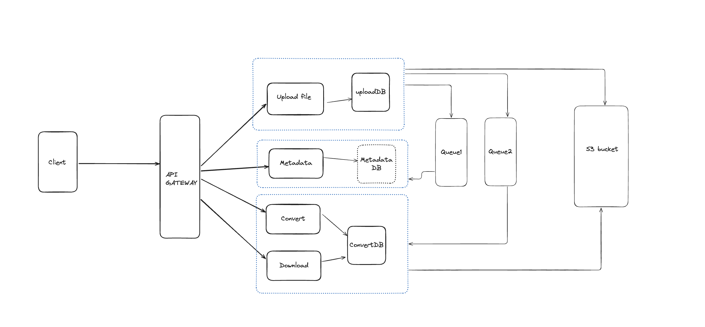

# **RapidFort Assignment**

## **Overview**
The **docs to pdf convertor ** is a microservice-based application that enables users to:
- Upload `.docx` files.
- Extract metadata from uploaded files.
- Convert `.docx` files to PDF format.
- Download the converted PDF files.

This project follows best practices for software development, including modular architecture, secure secret management, and CI/CD integration.

---

## **Features**
1. **File Upload**: Users can upload `.docx` files through a simple UI or API endpoint.
2. **Metadata Extraction**: Extract metadata such as file size, upload date, and document properties.
3. **File Conversion**: Convert `.docx` files to PDF format using LibreOffice.
4. **File Download**: Download the converted PDF files through a secure endpoint.
5. **Error Handling**: Comprehensive error handling at each stage of the process.
7. **Scalable Design**: Uses `Bull` for asynchronous job processing and AWS S3 for scalable file storage.

---

## **Tech Stack**
- **Backend**: Node.js, Express.js
- **Frontend**: React.js
- **Queue Management**: Bull (Redis-based)
- **Database**: MongoDB
- **File Storage**: AWS S3
- **File Conversion**: LibreOffice

---

## **System Architecture**

